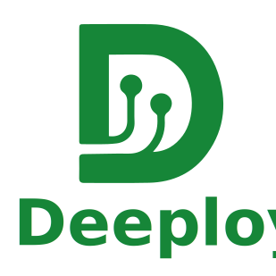

.. SPDX-FileCopyrightText: 2024 ETH Zurich and University of Bologna
..
.. SPDX-License-Identifier: Apache-2.0

Deeploy Documentation
=====================

.. Insert the DeeployLogoGreen.svg image and flow it to the left

Deeploy is an ONNX-to-C compiler that generates low-level optimized C Code for multi-cluster, heterogeneous SoCs. Its goal is to enable configurable deployment flows from a bottom-up compiler perspective, modeling target hardware in a fine-grained and modular manner.

Deeploy is developed as part of the PULP project, a joint effort between ETH Zurich and the University of Bologna.

.. toctree::
   :maxdepth: 3
   :caption: Contents:

   install
   tutorials/overview
   structure
   apidocs
   releasing
