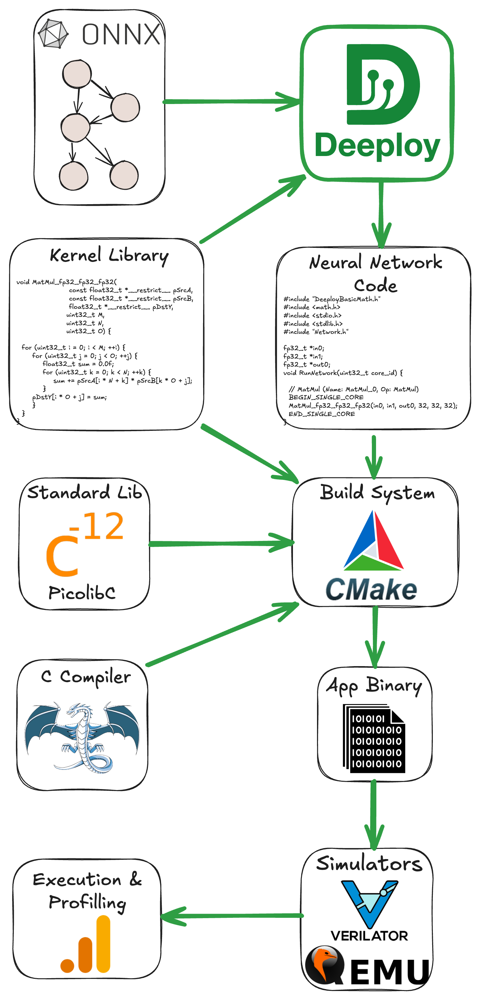
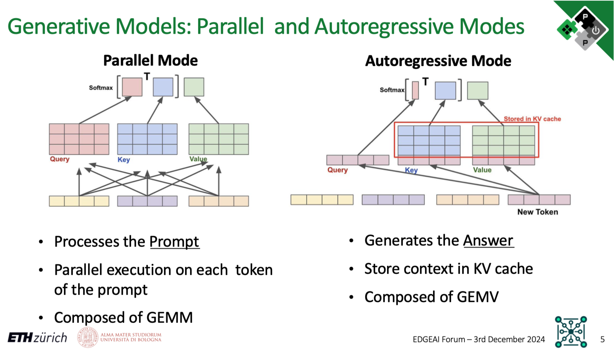
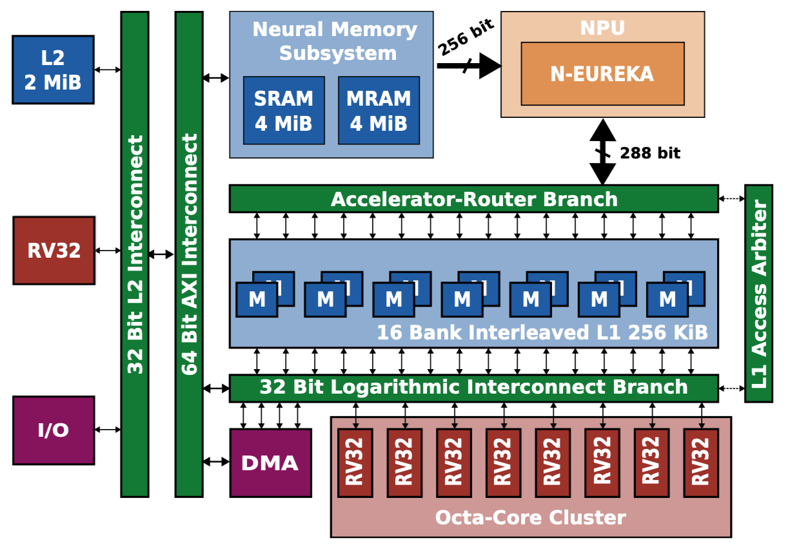

<div style="display: flex; justify-content: space-between; align-items: center;">
 
 <div style="text-align: right;">
 <p>Institut für Integrierte Systeme <br>
 Integrated Systems Laboratory</p>
 </div>
</div>


# Neural Network Deeployment on the PULP Platform
Author: *Victor J.B Jung* <br>
        *Viviane Potocnik* (Part III) <br>
Date: 27th May 2025 (Parts I–II) · 28th May 2026 (Part III)

## Installation

**⚠️ DISCLAIMER: The current container and commit are from main and devel, they will be tagged in the next release**

Clone Deeploy and its submodules:
```
git clone https://github.com/pulp-platform/Deeploy.git && cd Deeploy
git submodule update --init --recursive
```
Pull the docker image:
```
docker pull ghcr.io/pulp-platform/deeploy:main
```
Run the container and bind Deeploy's folder in the container:
```
docker run -it --name deeploy_main -v $(pwd):/app/Deeploy ghcr.io/pulp-platform/deeploy:main
```
Install Deeploy inside the container:
```
cd Deeploy
pip install -e .
```

From the `DeeployTest` folder, you can use the `deeployRunner` to compile ONNXs and execute the output code using the appropriate simulators.

To validate your installation, you can run a simple Add node on each platform:
```
python deeployRunner_generic.py -t Tests/Kernels/Integer/Add/Regular
python deeployRunner_cortexm.py -t Tests/Kernels/Integer/Add/Regular
python deeployRunner_mempool.py -t Tests/Kernels/Integer/Add/Regular
python deeployRunner_snitch.py -t Tests/Kernels/Integer/Add/Regular
python deeployRunner_siracusa.py -t Tests/Kernels/Integer/Add/Regular --cores=8
```
Once all these basic tests are passed, we can jump into the basics of Deeploy.

## Installation (SoCDAML course)

Students in ETH Zürich's *Systems-on-Chip for Data Analytics and Machine Learning* course use Singularity instead of Docker, because the lab machines don't expose the Docker daemon. **Each student builds their own writable sandbox in their scratch directory**.

The Singularity equivalent of the Docker command
```bash
docker run -it --name deeploy_main -v $(pwd):/app/Deeploy ghcr.io/pulp-platform/deeploy:main
```
is the six-step sequence below. The key part of the translation: Docker's `-v $(pwd):/app/Deeploy` (bind-mount the host clone) becomes Singularity's `--bind "$SCRATCH/Deeploy:/app/Deeploy"`.

### 1. Choose a writable scratch directory, and move every cache off your home
On most lab machines this is `/scratch/$USER`. If it doesn't exist for you, fall back to a subdirectory of the course scratch:
```bash
SCRATCH=/scratch/$USER
[ -d "$SCRATCH" ] || SCRATCH=/scratch/deeploy/$USER
mkdir -p "$SCRATCH" && cd "$SCRATCH"

# Keep the big caches on scratch. Apptainer reads APPTAINER_CACHEDIR and only
# accepts the SINGULARITY_ spelling as a deprecated fallback, so set both.
export APPTAINER_CACHEDIR="$SCRATCH/.singularity_cache"
export SINGULARITY_CACHEDIR="$SCRATCH/.singularity_cache"
export CCACHE_DIR="$SCRATCH/.ccache"
export PIP_CACHE_DIR="$SCRATCH/.pip_cache"
mkdir -p "$CCACHE_DIR" "$PIP_CACHE_DIR"
```

> ⚠️ **Do not skip the exports.** `singularity build` stages the image layers through
> `SINGULARITY_CACHEDIR`, which defaults to `$HOME/.singularity/cache`. On a quota'd
> home the build aborts partway through with
> `FATAL: While performing build: conveyor failed to get: error writing layer: ... disk quota exceeded`.
> The container's `ccache` is likewise configured for `$HOME/.ccache` with a 5 GB
> ceiling, and it will quietly consume your entire quota across a few builds, because
> Singularity mounts your real `$HOME` inside the container even under `--cleanenv`.
>
> The exports above protect the **host** side only: the `build` in step 3 runs outside
> the container, so it picks them up. They do *not* reach the container shell, because
> `--cleanenv` deliberately drops the host environment. That is why step 5 binds the two
> cache directories into the sandbox and re-injects the variables with `--env`; skipping
> those flags puts `ccache` and `pip` straight back onto your home quota.

Budget roughly **35 GB of scratch** in total: about 8 GB for the sandbox itself plus
about 26 GB of image cache. The cache is only needed for the build and can be deleted
afterwards with `rm -rf "$SINGULARITY_CACHEDIR"`.

### 2. Clone the lab branch on the host
This keeps your edits visible outside the container, exactly like the host clone you'd use with Docker:
```bash
git clone -b fs26ex https://github.com/viv-eth/Deeploy.git
cd Deeploy && git submodule update --init --recursive && cd ..
```

### 3. Build the writable Singularity sandbox
Pull the public Deeploy Docker image and convert it into a writable sandbox under your scratch (takes ~5-10 min the first time):
```bash
singularity build --sandbox DeeployContainer/ docker://ghcr.io/pulp-platform/deeploy:main
```

### 4. Pre-create the bind-mount targets inside the sandbox
Writable Singularity sandboxes don't auto-create bind-mount targets (read-only `.sif` images do, via overlay). The Deeploy image has `/app/` but no `/app/Deeploy/` subdirectory, and it has no mount points for the caches either, so create all three once:
```bash
mkdir -p "$SCRATCH/DeeployContainer/app/Deeploy"
mkdir -p "$SCRATCH/DeeployContainer/ccache" "$SCRATCH/DeeployContainer/pipcache"
```

### 5. Spawn a shell in the container, with your Deeploy clone bind-mounted
You **must** have completed steps 3 and 4 before this works.`singularity shell` opens an *existing* sandbox, it doesn't create one. Re-run this command every time you log back in:
```bash
singularity shell --bind "$SCRATCH/Deeploy:/app/Deeploy" \
                  --bind "$CCACHE_DIR:/ccache" \
                  --bind "$PIP_CACHE_DIR:/pipcache" \
                  --writable --cleanenv \
                  --env CCACHE_DIR=/ccache \
                  --env PIP_CACHE_DIR=/pipcache \
                  "$SCRATCH/DeeployContainer/"
```
The first `--bind` mounts your host clone at `/app/Deeploy` inside the container, i.e.the direct equivalent of Docker's `-v` flag. The other two put the `ccache` and `pip` caches on scratch, and the matching `--env` flags point the tools at them: `--cleanenv` wipes the host environment on the way in, so the exports from step 1 have to be re-injected here rather than inherited. Both variables have to be set in the shell you launch this from — on a fresh login they won't be, so re-run the export block from step 1 first.

If you forget to pre-create the target you'll see:
```text
FATAL: ... destination /app/Deeploy doesn't exist in container
```
That means you need to run the `mkdir -p` from step 4 first.

If the *source* side is missing instead:
```text
FATAL: ... mount source /ccache doesn't exist
```
then `$CCACHE_DIR` or `$PIP_CACHE_DIR` is unset in your shell, so the bind collapsed to `:/ccache`. Re-run the export block from step 1.

**When the shell opens, you will land in `/home/$USER`** (Apptainer auto-mounts your host home, and your host CWD `$SCRATCH` doesn't exist as a path inside the container). To get to your Deeploy code, navigate to the bind-mount target:
```bash
cd /app/Deeploy
ls   # should show CHANGELOG.md, CMakeLists.txt, Deeploy/, DeeployTest/, ...
```

### 6. Install Deeploy in editable mode
Inside the container:
```bash
cd /app/Deeploy
pip install -e .
```

Then navigate to `DeeployTest/` and validate the install with the same five `deeployRunner_*.py` commands listed in the general install above.

## Deeploy 101

Deeploy is a compiler that transforms static computational graph (represented with the [ONNX format](https://onnx.ai/onnx/operators/)) into bare-metal and (hopefully) optimized [C](https://www.c-language.org/). More specifically, it generates an application that can be deployed on the desired platform.

Hence, Deeploy's inputs are:
- An ONNX file describing your neural network.
- Input tensors.
- Expected output tensors generated with your favorite framework (ONNXRuntime or Torch, for instance).

Deeploy is shipped with a comprehensive testing framework conveniently named DeeployTest. This testing framework contains Test Runners for end-to-end testing of your network on a given platform. More specifically, a Test Runner compiles a given ONNX file, builds the project, feeds the inputs into the compiled neural network, and compares the output with the golden values to ensure correctness.

If you followed this tutorial correctly, you already used Test Runners (e.g., `deeployRunner_siracusa.py`) to validate the Deeploy installation! We will dive into the details of the Test Runners CLI very soon, but first, let's look at the tools and libraries used downstream in Deeploy.

The figure below gives an overview of the deployment stack. As you can see, there are several steps to take before actually running the application. For the build system (*e.g.,* the tool to organize compilation and linking), we use [CMake](https://cmake.org/). The default C compiler shipped with Deeploy is [LLVM 15](https://llvm.org/), but it supports GCC, given that you provide a local installation. To generate the Application Binary, we link the Network Code with the necessary Kernel Libraries and a Standard C Library (here [Picolibc](https://github.com/picolibc/picolibc)). Then, we feed this Application Binary to the appropriate simulator; from there, you can verify the correctness and benchmark the application.

<p align="center">
 
</p>

You can visualize the ONNX graphs using [Netron](https://netron.app/). Either use the web interface or install the python package with `pip install netron`.

> ✅ **Task:** Visualize the ONNX graph of the `Tests/Kernels/Integer/Add/Regular`, `Tests/Models/MobileNetv2`, and `Tests/Models/Transformer`

The ONNX graphs are in `DeeployTest/Tests/<TestName>/network.onnx`. The networks are increasing in complexity, `Tests/Kernels/Integer/Add/Regular` is a single node network for unit testing, while `Tests/Models/MobileNetv2` is a simple sequential network mostly made of convolutions. Finally, the `Tests/Models/Transformer` network showcases a typical transformer block used in Encoder and Decoder networks. If you want to peek at a complex network, you can visualize `Tests/Models/microLlama/microLlama128`.

Now that we understand Deeploy's input, let's check the output-generated code!

> ✅ **Task:** Take a look at the code generated by Deeploy for the Generic platform.

The generated code is located in the following directory: `DeeployTest/TEST_<PlatformName>/Tests`, and the `Network.c` file is the interesting one.

The generated code is trivial for the `Tests/Kernels/Integer/Add/Regular` graph; we simply use the template for the `Add` node of the Generic platform. You can find the template declaration in `Deeploy/Targets/Generic/Templates/AddTemplate.py`.

Now, if you want to look at something a bit more complex, run `python deeployRunner_generic.py  -t ./Tests/Models/miniMobileNetv2` (from `DeeployTest`) and look at the generated code. There are two interesting points you can notice:
- We hoist the constants at the top of the file.
- In the `RunNetwork` function, we sequentially have node templates to execute the operands and malloc/free to manage the memory. You can open the ONNX graph of `Tests/Models/miniMobileNetv2` on the side to try to match the nodes of the graph with their generated code.

> ✅ **Task:** Visualize the effect of passes on the ONNX graph for the Siracusa platform.

Deeploy applies passes on the ONNX graph to transform its topology and optimize its execution. Let's visualize the effect of the passes used in the Siracusa Platform. First, let's execute our `miniMobileNetv2` on Siracusa with `python deeployRunner_siracusa.py  -t ./Tests/Models/miniMobileNetv2`. You can find the original ONNX graph at `Tests/Models/miniMobileNetv2/network.onnx`, and the transformed ONNX graph at `TEST_SIRACUSA/Tests/Models/miniMobileNetv2/deeployStates/backend_post_binding.onnx`. Open both ONNX graphs side by side to compare them.

You can notice the effect of two passes on the graph:
- One pass fuses the `Conv` and `RequantShift` nodes. This is a common technique named [Operator Fusion](https://medium.com/data-science/how-pytorch-2-0-accelerates-deep-learning-with-operator-fusion-and-cpu-gpu-code-generation-35132a85bd26) and used in many DNN compilers.
- Another pass is adding a `Transpose` node before the `RequantizedConv` in order to align the tensor layout from CHW to HWC (where C = Channels, H = Height, and W = Width). The HWC tensor layout is required to use optimized Convolution kernels (to learn more, check out [this blog post](https://www.intel.com/content/www/us/en/developer/articles/technical/pytorch-vision-models-with-channels-last-on-cpu.html)).

Now that you understand the basics of Deeploy let's jump into the optimized deployment of a small language model on the Siracusa SoC.

## Micro Llama on Siracusa

### Transformers 101

In this section, we will study the optimization of the deployment of a small language model. To fully understand this section, you need some basic understanding of Transformer's architecture and Language Model inference mode. If you need a refresher on Transformer's architecture, check out the *Transformer Basics* section of [Lilian Weng's blog post](https://lilianweng.github.io/posts/2023-01-27-the-transformer-family-v2/#transformer-basics).

Now, Language Models have two inference modes:
- The **Parallel Mode** (AKA *Prefill Mode*) is used to process the tokens of the prompts in parallel and generate the KV cache of the prompt and the first token of the Language Model's "reply". This mode contains mostly GEMMs.
- The **Autoregressive Mode** generates the rest of the Language Model's reply. It uses the KV cache from the previous step, generates a new KV cache entry, and predicts the next token. This mode contains mostly GEMVs.

To summarize, to generate a Language Model reply of $N$ tokens, there is:
- One **Parallel Mode** inference to process the prompt and generate the first token.
- $N-1$ **Autoregressive Mode** inferences to generate the rest of the tokens.

The slide below visually represents the **Parallel Mode** and **Autoregressive Mode**.

<p align="center">
 
</p>

### The Siracusa Platform

Let's also quickly refresh our knowledge of the Siracusa platform to understand what kind of hardware we must deploy on. Below is the high-level block diagram of Siracusa, compute-wise we will mainly use:
- The cluster of RV32 cores, they are modified to be great at crunching numbers. They feature [SIMD](), hardware loops (see the [RI5CY user manual](https://www.pulp-platform.org/docs/ri5cy_user_manual.pdf), p17), and the [XPULP](https://pulp-platform.org/docs/hipeac/acaces2021/04_PULP_Accelerators.pdf) ISA extensions.
- The [NEUREKA](https://github.com/pulp-platform/neureka) NPU, an accelerator targeting integer convolutions.

In terms of memories, we have:
- L3: An off-chip RAM (not shown on the block diagram) of 16MB capacity. The L3 has its own DMA that can transfer data to L2.
- Neural Memory Subsystem (NMS): An SRAM/MRAM-based *Weight Memory* to store constants with a direct link to the NPU.
- L2: An on-chip SRAM-based L2 memory of 2MB.
- L1: A TCDM memory of size 256KB.

The on-chip DMA indicated on the block diagram can transfer data between the Weight Memory, the L2, and the L1.

<p align="center">
 
</p>

Now that you understand the hardware and the kind of workload we want to execute. Let's deploy using various optimizations to study their impact. The first parameter we can play with is the number of cores from the RV32 cluster to use.

> ✅ **Task:** Measure and compare the runtime of the `microLlama128` model using 1 and 8 cores. Compute the speedup ratio; why is it not 8?

*Hint:* `python deeployRunner_siracusa.py --help` will list and explain the available flags.

<details>
 <summary><span style="font-weight: bold; font-size: 1.3em;">Solution</span></summary>

 > If you run `python deeployRunner_siracusa.py -t Tests/Models/microLlama/microLlama128 --cores=1` and then `python deeployRunner_siracusa.py -t Tests/Models/microLlama/microLlama128 --cores=8`, you should measure a runtime of ~16,1M cycles for 1 core and 3.1M cycles for 8 cores.
 >
 > The speedup ratio is obtained via $\frac{\text{Runtime 1 cores}}{\text{Runtime 8 cores}} = 5.2$. Hence, using 8 cores instead of 1 leads to a 5.2 times speedup.
 >
 > So why is the speedup ratio below 8? Mostly because all data movement is not overlapped with computation. Additionally, some kernels are probably not optimally parallelized for this specific network.
</details>

### Tiling Basics

It's due time to talk about data movement now! We use all 8 cluster cores, which is great, but where do these cores fetch the data from? By default, when using `deeployRunner_siracusa.py`, all data is in L2; there is no tiling, and cores read and write data directly to/from L2. As the L2 memory is "further away" from the cluster, load/store takes several cycles, which is non-optimal.

What we really want is to use the L1 memory, which provides 1 cycle latency load/store! But as the capacity is relatively small (256KB), we need to **tile our layers**. Tiling operands for an accelerator featuring only scratchpad memories is not trivial (unlike in architectures with data caches). For each layer, the compiler has to decide on tile size, a tiling schedule, a buffering strategy (single buffer, double buffer, etc...), and a memory allocation strategy. Then, the compiler must generate the code to configure and launch each transfer and place barriers accordingly to maximize concurrency.

The good news is that Deeploy can already do that! So, let's generate and run some tiled code to see the impact of tiling on the runtime.

> ✅ **Task:** Get familiar with the CLI arguments of `deeployRunner_tiled_siracusa.py`, then run `microLlama64_parallel` with different configurations. Find one "bad" and one "good" configuration, and explain why.

*Hint:* Use the `--help` flag to list and explain the available flags.

<details>
 <summary><span style="font-weight: bold; font-size: 1.3em;">Solution</span></summary>

 > Bad configuration: `python deeployRunner_tiled_siracusa.py -t Tests/Models/microLlama/microLlama64_parallel --cores=8 --l1 8000 --defaultMemLevel=L2` -> Runtime: 47.5 MCycles
 >
 > Good configuration `python deeployRunner_tiled_siracusa.py -t Tests/Models/microLlama/microLlama64_parallel --cores=8 --l1 64000 --defaultMemLevel=L2`: -> Runtime: 35.3 MCycles
 >
 > Justification: As the size of the L1 memory gets smaller, tiles also get smaller and smaller. Smaller tiles usually mean that it's harder to keep the core properly utilized.

</details>

### Profiling the Execution

To measure the effect of some optimizations in more detail, you can use the `--profileTiling` flag. This flag will enable a code transformation that will insert print statements displaying the runtime of several critical code sections. For instance, profiling an *Integer Layer Normalization* layer from L2 with two tiles will print the following:
```
[INTEGER_RMSNORM L2][SB][0 ops][Tile 0] Input DMA took 489 cycles
[INTEGER_RMSNORM L2][SB][0 ops][Tile 0] Kernel took 43305 cycles
[INTEGER_RMSNORM L2][SB][0 ops][Tile 0] Output DMA took 534 cycles
[INTEGER_RMSNORM L2][SB][0 ops][Tile 1] Input DMA took 82 cycles
[INTEGER_RMSNORM L2][SB][0 ops][Tile 1] Kernel took 3254 cycles
[INTEGER_RMSNORM L2][SB][0 ops][Tile 1] Output DMA took 49 cycles
```
With this profiling trace, you can clearly measure the overhead of DMA transfers. When the profiling is turned ON, the total runtime of the application will encompass the prints.

> ⚠️ **Known bug (as of this writing).** `--profileTiling` currently crashes GVSOC on
> the larger microLlama graphs. On
> `deeployRunner_tiled_siracusa.py -t Tests/Models/microLlama/microLlama64_parallel --cores=8 --l1 64000 --defaultMemLevel=L2 --profileTiling`
> the simulator aborts with
> `Invalid access (pc: 0x1c00b944, offset: 0x57575757, size: 0x1, is_write: 0)`,
> while the exact same command *without* `--profileTiling` passes cleanly
> (`Errors: 0 out of 69632`). Profiling does work on small single-node graphs such as
> the Part III `Tests/Kernels/Integer/LeakyReLU/Regular` test. If you hit this, it is
> not your mistake. Collect the layer-level numbers on the smaller graphs, or
> compare end-to-end runtimes without the flag.

### Using the NPU and the Neural Memory Subsystem (NMS)

To use the NPU, you can use the `deeployRunner_tiled_siracusa_w_neureka.py`. The Linear layers will automatically be executed by the NPU. To enable the NMS, use the `--neureka-wmem` flag. When the NMS is enabled, the constant tensors used by the accelerator will be placed in the Weight Memory.

> ✅ **Task:** Execute Micro Llama in parallel and autoregressive mode using the NPU, derive the speedup at the model level and at the layer level compared to execution without NPU.

*Hint:* Save the profiling traces somewhere to reason about them later on.

> ✅ **Task:** Why does the NPU bring more speedup in parallel mode than in autoregressive mode?

<details>
 <summary><span style="font-weight: bold; font-size: 1.3em;">Solution</span></summary>

 > The runtime in parallel mode with NPU is obtained with:
 >
 >`
 python deeployRunner_tiled_siracusa_w_neureka.py -t Tests/Models/microLlama/microLlama64_parallel --cores=8 --l1 64000 --defaultMemLevel=L2
 `
 >
 > And returns 28.6 MCycles of runtime. The runtime without NPU was measured above and is 35.3 MCycles. Hence, the speedup is ~1.23 times.
 >
 > We apply the same methodology on `microLlama64` and get a speedup of ~1.04 times.
 >
 > Now, why is the speedup lesser in autoregressive mode compared to parallel mode? This is because the parallel mode is composed mainly of GEMM, while the autoregressive mode uses GEMV. With GEMV, the accelerator is underutilized as the [operational intensity](https://spcl.inf.ethz.ch/Teaching/2013-dphpc/lecture9-6up.pdf) of GEMV is very low, especially compared to GEMM.
 >
 > Additionally, in autoregressive mode (unlike in parallel mode), you have to load the KV cache, which requires lots of data movement not accelerated by the NPU.

</details>
<br>

> ✅ **Task:** Benchmark the effect of the NMS on the model runtime and at the layer level. Do you notice any speedup? If yes, where does it come from?

<details>
 <summary><span style="font-weight: bold; font-size: 1.3em;">Solution</span></summary>

 > Using the NMS brings the runtime from 857 to 780 KCycles for the autoregressive mode and from 28.6 to 28.3 MCycles for the parallel mode. By inspecting the trace, you can notice that the NMS drastically reduces the time spent on input DMA transfers for the layers offloaded to the NPU.
 >
 > This is the profiling trace for a layer without using the NMS:
 ```
 [RequantizedPwConv_L2][SB][32771 ops][Tile 0] Input DMA took 2037 cycles
 [RequantizedPwConv_L2][SB][32771 ops][Tile 0] Kernel took 2649 cycles
 [RequantizedPwConv_L2][SB][32771 ops][Tile 0] Output DMA took 50 cycles
 ```
 > And this is with the NMS activated:
 ```
 [RequantizedPwConv_L2][SB][32771 ops][Tile 0] Input DMA took 125 cycles
 [RequantizedPwConv_L2][SB][32771 ops][Tile 0] Kernel took 2595 cycles
 [RequantizedPwConv_L2][SB][32771 ops][Tile 0] Output DMA took 56 cycles
 ```
</details>
<br>

> ✅ **Task:** Why does the autoregressive mode benefit more from the NMS than the parallel mode?

<details>
 <summary><span style="font-weight: bold; font-size: 1.3em;">Solution</span></summary>

 > Using the NMS relaxes the memory boundness of the NPU. In the GEMM, we are not in a memory-bound regime, and the DMA transfer overhead is negligible with regard to the total runtime. In the autoregressive mode, we spend a lot of time on DMA transfers; hence, providing more bandwidth to the accelerator is very beneficial.

</details>
<br>

## Adding a New Operator

So far you've used Deeploy as a black box: you fed in ONNX graphs and looked at the C it spat out. In this last hour you'll open the box and add your own operator from scratch, which will be an int8 LeakyReLU. You will be walking through every stage of the compiler that the previous sections merely showed you in passing. By the end you'll have written a parser, a C kernel, a Mako template, a tiling constraint and (if you're quick) an XPULP SIMD intrinsic version. We stay on the Siracusa platform throughout (the same target as the previous section), so every `deeployRunner_*` command below uses the Siracusa runner.

> 💡 **Recommended background:** the internal Deeploy training guide (Parts 1–2) covers the main classes (Parser / Mapper / Binding / Template / TypeChecker / TileConstraint) you're about to touch. Reference PRs to skim: [#25](https://github.com/pulp-platform/Deeploy/pull/25) (basic op on Generic), [#26](https://github.com/pulp-platform/Deeploy/pull/26) (adding tiling + PULP), [#29](https://github.com/pulp-platform/Deeploy/pull/29) (multi-op for a real model).

### The operator

`iLeakyReLU` is an elementwise unary that approximates the standard LeakyReLU using only integer arithmetic:

$$
\text{out}[i] = \begin{cases} \text{in}[i] & \text{if } \text{in}[i] \ge 0 \\ \lfloor (\text{mul} \cdot \text{in}[i]) / 2^{\text{shift}} \rfloor & \text{otherwise} \end{cases}
$$

With `mul=1, shift=3` you get a slope of $\alpha \approx 0.125$, which is close enough to the standard 0.01 that quantized networks tolerate well.

### What we provide

A starting kit lives under `Tutorials/PartIII_skeletons/iLeakyReLU/`. Each file contains the surrounding boilerplate plus `TODO(student)` markers. You'll fill the blanks **in place** (no need to copy them anywhere yet). In the steps below, each file then gets *installed* into a specific location in the live source tree (every skeleton's header comment names that destination). If you get stuck, the full reference is in `Tutorials/PartIII_solution/iLeakyReLU/`. We rely on your independence, and only peek **after** you've tried. Otherwise you won't have any learning effect.

> ✅ **Task:** Open every file in `Tutorials/PartIII_skeletons/iLeakyReLU/` and read its header comment. Note where each one will eventually be installed (e.g. parser → `Deeploy/Targets/Generic/Parsers.py`, kernel → `TargetLibraries/PULPOpen/src/`). Don't edit anything yet. Just get an idea of how operators are structured in Deeploy.

### Step 1: Generate the ONNX graph + golden values

The script `generate.py` (already complete) builds a single-node ONNX with the `op_type` `iLeakyReLU` plus matching `inputs.npz` / `outputs.npz`. Run it once and check the produced files:

```bash
cd Tutorials/PartIII_skeletons/iLeakyReLU
python generate.py
mkdir -p ../../../DeeployTest/Tests/Kernels/Integer/LeakyReLU/Regular
cp network.onnx inputs.npz outputs.npz ../../../DeeployTest/Tests/Kernels/Integer/LeakyReLU/Regular/
```

> ✅ **Task:** Open `network.onnx` in Netron and check that the node has op_type `iLeakyReLU` and `mul`/`shift` attributes.

### Step 2: Write the parser

Open `iLeakyReLUParser.py` and fill in `parseNode` (validate attrs + inputs) and `parseNodeCtxt` (extract input/output tensor names and `size`). Paste the finished class into `Deeploy/Targets/Generic/Parsers.py`.

A parser should also refuse attributes your kernels can't implement, so the build fails instead of producing wrong results on the device. Reject `mul != 1` (the SIMD kernel has no per-lane multiply) and any `shift` outside `[0, 8)` (it shifts 8-bit `v4s` lanes).

Test in *verbose* mode (Step 1 left you in `Tutorials/PartIII_skeletons/iLeakyReLU`, so walk back up to the repo root first):
```bash
cd ../../../DeeployTest
python deeployRunner_siracusa.py -t Tests/Kernels/Integer/LeakyReLU/Regular --cores=8 -vv
```

This first run will fail later in the pipeline (no template/binding/kernel yet) but you should see your parser fire and accept the node. Use `-vvv` if you want even more diagnostics from the build system and simulator.

<details>
 <summary><span style="font-weight: bold; font-size: 1.3em;">Hint</span></summary>

 > Pattern to copy: `iHardswishParser` in `Deeploy/Targets/Generic/Parsers.py`. Its only attrs are `one_over_six / three / six`, the same shape as your `mul / shift`. The `iRMSNormParser` higher up in the same file is also useful.

</details>

### Step 3: Write the C kernel (plain C)

In `iLeakyReLU.c` the per-core chunking is given. Fill the inner loop:
```c
int32_t x  = (int32_t)pIn[i];
int32_t lo = (mul * x) >> shift;
pOut[i]    = (int8_t)((x >= 0) ? x : lo);
```

Drop the finished `.c` into `TargetLibraries/PULPOpen/src/`. Drop the header (`iLeakyReLU.h`, already complete) into `TargetLibraries/PULPOpen/inc/kernel/`. Then add **one line** to `TargetLibraries/PULPOpen/inc/DeeployPULPMath.h`:
```c
#include "kernel/iLeakyReLU.h"
```

> ⚠️ The PULPOpen CMakeLists auto-globs `src/**`, so you don't need to touch it. You **do** need that aggregator include in `DeeployPULPMath.h` though.

### Step 4: Template, binding, mapper

Three small pieces wire the parser to the kernel.

**1. Template.** Fill in the Mako body of `iLeakyReLUTemplate.py` so it emits a single call to your C kernel. Drop the finished file into `Deeploy/Targets/PULPOpen/Templates/`. Pattern to copy: `Deeploy/Targets/PULPOpen/Templates/iSoftmaxTemplate.py`.

<details>
 <summary><span style="font-weight: bold; font-size: 1.3em;">Solution</span></summary>

 > ```python
 > referenceTemplate = _iLeakyReLUTemplate("""
 > // iLeakyReLU (Name: ${nodeName}, Op: ${nodeOp})
 > PULPiLeakyReLU_i8_i8(${data_in}, ${data_out}, ${size}, ${mul}, ${shift});
 > """)
 > ```
 > Mako `${...}` substitutions come straight from `self.operatorRepresentation` (populated by your parser). `nodeName` / `nodeOp` are auto-filled by Deeploy.

</details>

**2. Binding.** In `Deeploy/Targets/PULPOpen/Bindings.py`, define a `PULPiLeakyReLUBindings` list. A binding is a 3-tuple of *(TypeChecker, Template, CodeTransformation)*. For our `int8 → int8` op, reuse `GELUChecker` (same `int8 → int8` signature, and it propagates signedness) and `ForkTransformer` (forks the kernel call across the 8 cluster cores). Also add the matching import for your template.

<details>
 <summary><span style="font-weight: bold; font-size: 1.3em;">Solution</span></summary>

 > Near the other `from Deeploy.Targets.PULPOpen.Templates import` line, add:
 > ```python
 > from Deeploy.Targets.PULPOpen.Templates import iLeakyReLUTemplate
 > ```
 > Then append the binding list:
 > ```python
 > PULPiLeakyReLUBindings = [
 >     NodeBinding(
 >         GELUChecker([PointerClass(int8_t)], [PointerClass(int8_t)]),
 >         iLeakyReLUTemplate.referenceTemplate,
 >         ForkTransformer)
 > ]
 > ```
 > **Why `GELUChecker`?** A checker doesn't only match types, it also declares whether the output is signed. `ReluChecker` hard-codes *unsigned*, which is right for ReLU but wrong here: LeakyReLU keeps negative values, about half of our output. `GELUChecker` has the same `int8 → int8` signature and propagates the input's signedness instead. **Why `ForkTransformer`?** It wraps the emitted kernel call into `pi_cl_team_fork(NUM_CORES, ...)`, which is exactly what our multi-core kernel expects.

</details>

**3. Mapper.** In `Deeploy/Targets/PULPOpen/Platform.py`, define `iLeakyReLUMapper` (a `NodeMapper` that pairs your parser with the binding list) and register the ONNX op name in `PULPMapping`. Reuse `iHardswishLayer` (a trivial `ONNXLayer` that does no extra shape/cost work, i.e. same shape as ours).

<details>
 <summary><span style="font-weight: bold; font-size: 1.3em;">Solution</span></summary>

 > Imports near the existing Hardswish ones:
 > ```python
 > from Deeploy.Targets.Generic.Parsers import iLeakyReLUParser   # add to the list
 > from Deeploy.Targets.Generic.Layers  import iHardswishLayer    # already imported
 > from Deeploy.Targets.PULPOpen.Bindings import PULPiLeakyReLUBindings  # add to the list
 > ```
 > ⚠️ All three imports are required. The parser import in particular is easy to
 > miss because `Platform.py` pulls the Generic parsers in via a single wrapped
 > multi-line `from ... import` block: append `iLeakyReLUParser` inside that block
 > (or add a separate import line). Forgetting it fails at *import* time with
 > `NameError: name 'iLeakyReLUParser' is not defined`, which breaks **every** PULP
 > runner, not just your new op.
 > Mapper definition (next to `iHardswishMapper`):
 > ```python
 > iLeakyReLUMapper = NodeMapper(iLeakyReLUParser(), PULPiLeakyReLUBindings)
 > ```
 > `PULPMapping` entry (next to `'iHardswish'`):
 > ```python
 > 'iLeakyReLU': iHardswishLayer([iLeakyReLUMapper]),
 > ```

</details>

Test untiled execution on Siracusa:
```bash
python deeployRunner_siracusa.py -t Tests/Kernels/Integer/LeakyReLU/Regular --cores=8
```
Do you observe any mismatches? How many cycles does the execution take?

### Step 5: Tiling constraint

Open `iLeakyReLUTileConstraint.py`. It already subclasses `UnaryTileConstraint`, so the geometry (input dim == output dim per axis) and the schedule serializer come for free. Leave the body empty for now (the performance constraint comes in Step 6a).

Drop the file into `Deeploy/Targets/PULPOpen/TileConstraints/`. Then **register the tiling-ready binding** in `Deeploy/Targets/PULPOpen/Tiler.py`: wrap your binding list with `TilingReadyNodeBindings(...)` so Deeploy knows which constraint to apply, and finally update the mapper in `Platform.py` to use the tiling-ready variant.

<details>
 <summary><span style="font-weight: bold; font-size: 1.3em;">Solution</span></summary>

 > In `Tiler.py`, add the imports near the other tile-constraint imports:
 > ```python
 > from Deeploy.Targets.PULPOpen.TileConstraints.iLeakyReLUTileConstraint \
 >     import iLeakyReLUTileConstraint
 > from Deeploy.Targets.PULPOpen.Bindings import PULPiLeakyReLUBindings
 > ```
 > Then append the binding bundle:
 > ```python
 > PULPiLeakyReLUTilingReadyBindings = TilingReadyNodeBindings(
 >     nodeBindings  = PULPiLeakyReLUBindings,
 >     tileConstraint = iLeakyReLUTileConstraint())
 > ```
 > In `Platform.py`, swap the Step 4 binding import for the tiling-ready one and
 > change the mapper:
 > ```python
 > from Deeploy.Targets.PULPOpen.Tiler import PULPiLeakyReLUTilingReadyBindings  # add to the list
 >
 > iLeakyReLUMapper = NodeMapper(iLeakyReLUParser(), PULPiLeakyReLUTilingReadyBindings)
 > ```
 > Reference pattern: `PULPiHardswishTilingReadyBindings` in the same file.

</details>

Run the tiled flow:
```bash
python deeployRunner_tiled_siracusa.py -t Tests/Kernels/Integer/LeakyReLU/Regular --cores=8 --l1=32768 --defaultMemLevel=L2
```

<details>
 <summary><span style="font-weight: bold; font-size: 1.3em;">Hint on the constraint itself</span></summary>

 > If you want a worked example of a unary quantized op, see `Deeploy/Targets/Generic/TileConstraints/iHardswishTileConstraint.py`.

</details>

How long does the execution take, i.e. how many cycles? What do you observe? Did you expect this result?

### Step 6: Add a performance constraint, then go SIMD

In this final step you'll add a tile-size constraint that aligns work with the SIMD width, then swap the plain-C kernel for a PULP-intrinsics version.

**(a) Performance constraint.** Go back to `iLeakyReLUTileConstraint.py` and add the multiple-of-16 constraint. The API you want is `addTileSizeDivisibleConstraint`, which forces the tile size along an axis to be an exact multiple of `modulo`. It looks up `parseDict[varName]` as the original axis size, so the parser must expose it; the easiest is to inject it from inside the constraint:

```python
inputShape = ctxt.lookup(parseDict['data_in']).shape
lastDim    = len(inputShape) - 1
lastDimVar = tilerModel.getTensorDimVar(tensorName=parseDict['data_in'], dimIdx=lastDim)
if inputShape[lastDim] >= 16:
    dimKey = f'dim_{lastDim}'
    parseDict[dimKey] = int(inputShape[lastDim])
    tilerModel.addTileSizeDivisibleConstraint(parseDict, dimKey, lastDimVar, 16)
```

> ⚠️ **Don't confuse the two constraint helpers.** `TilerModel` also offers
> `addMinTileSizeConstraint(parseDict, name, dimVar, modulo)`, which is a
> *minimum-remainder* constraint: it forces the leftover last tile to be at least
> `modulo` elements so you don't get a degenerate tail tile. It does **not** make
> the tile size a multiple of `modulo`. Use `addTileSizeDivisibleConstraint` when
> you need divisibility (as here, for SIMD alignment) and
> `addMinTileSizeConstraint` when you only want to outlaw tiny tail tiles.
> Real examples: `addTileSizeDivisibleConstraint` in
> `Deeploy/Targets/PULPOpen/TileConstraints/GEMMTileConstraint.py`, and
> `addMinTileSizeConstraint` in
> `Deeploy/Targets/PULPOpen/TileConstraints/ConvTileConstraint.py`.

Re-run with `--profileTiling`. The tile shape on the innermost dim now snaps to a multiple of 16; the per-core chunk is therefore a multiple of 4, i.e. exactly what the SIMD kernel needs. (The reference SIMD kernel is defensive anyway: it rounds the per-core chunk down to a multiple of 4 and keeps a scalar tail loop, so it stays correct even if you get the constraint wrong. Correct output is therefore *not* evidence that your constraint works; check the tile shapes in the profiling trace.)

**(b) PULP SIMD intrinsics.** Replace the scalar kernel with `iLeakyReLU_simd.c`. The trick: LeakyReLU has a closed-form identity that fits the XPULP intrinsic set perfectly. Because arithmetic right shift makes a negative value *less* negative (or zero) and doesn't change the sign of a non-negative value:

$$\text{LeakyReLU}(x) = \max(x,\; x \gg \text{shift})$$

So if you compute `x >> shift` on a packed `v4s` and feed both into `__builtin_pulp_max4`, you get LeakyReLU branch-free in just two packed operations per 4 lanes: load → packed shift → packed max → store:

```c
v4s x = vIn[i];
v4s s = x >> shift;                       // GCC vector ext: per-lane shift
vOut[i] = __builtin_pulp_max4(x, s);      // single packed signed max
```

The SIMD kernel ignores `mul` (assumes `mul == 1`); the generator picks `mul=1, shift=3` so the formula is identical.

Re-run with `--profileTiling`. Compare per-tile kernel cycles to your scalar baseline.

> ✅ **Task:** Quantify the speedup vs the scalar kernel. Why isn't it exactly 4×?

<details>
 <summary><span style="font-weight: bold; font-size: 1.3em;">Solution</span></summary>

 > In our reference run (`--l1=32768`, shape `(1,16,64,64)`) the end-to-end runtime drops from **108 090 cycles (scalar)** to **43 005 cycles (SIMD)**, a **2.51×** improvement. Why not exactly 4×? Not because the arithmetic failed to vectorise — it did. Disassemble the kernel and the loop body is one post-increment word load, `pv.sra.b` for `v4s s = x >> shift`, and `pv.max.b` for the blend: three instructions per four elements, exactly the packing you asked for. The limit is Amdahl's law. End-to-end time also includes DMA traffic between L2 and L1, per-tile bookkeeping, and the loop's own index and branch overhead, none of which shrink when the arithmetic does. The 4× applies only to the fraction of the runtime the inner loop actually owns. To push closer you'd have to attack that other fraction — larger tiles to amortise the DMA, or double buffering to overlap it with compute — not the kernel body. The full intrinsics inventory lives in `TargetLibraries/third_party/pulp-nn-mixed/XpulpV2/32bit/include/pulp_nn_utils.h`.

</details>

### Stacked speedup

To wrap up, measure your own cycle counts at each step and compute the speedups vs the single-core untiled baseline and step-to-step. Grab the missing baseline numbers with:

```bash
python deeployRunner_siracusa.py        -t Tests/Kernels/Integer/LeakyReLU/Regular --cores=1                                                # baseline
python deeployRunner_siracusa.py        -t Tests/Kernels/Integer/LeakyReLU/Regular --cores=8                                                # Step 4
python deeployRunner_tiled_siracusa.py  -t Tests/Kernels/Integer/LeakyReLU/Regular --cores=8 --l1=32768 --defaultMemLevel=L2                # Step 5 (scalar)
python deeployRunner_tiled_siracusa.py  -t Tests/Kernels/Integer/LeakyReLU/Regular --cores=8 --l1=32768 --defaultMemLevel=L2                # Step 6 (after deploying SIMD kernel)
```

> ✅ **Task:** Build a table comparing each step's cycle count to the baseline and to the previous step. Which transformation contributes the most? Is SIMD or parallelism the bigger lever for this op?

<details>
 <summary><span style="font-weight: bold; font-size: 1.3em;">Solution</span></summary>

 > Our reference run on shape `(1, 16, 64, 64)` = 65 536 elements with `--l1=32768`:
 >
 > | Step | Configuration | Cycles | vs baseline | vs previous step |
 > |------|---|---|---|---|
 > | baseline | 1 core, scalar, untiled | 2 492 970 | 1.00× | n/a |
 > | Step 4 | 8 cores, scalar, untiled | 313 541 | **7.95×** | 7.95× |
 > | Step 5 | 8 cores, scalar, tiled       | 108 090 | **23.06×** | 2.90× |
 > | Step 6 | 8 cores, SIMD,  tiled        |  43 005 | **57.97×** | 2.51× |
 >
 > Most of the win comes from parallelizing across cores (Step 4) and moving the working set into L1 (Step 5). SIMD is the last lever to pull and contributes ~2.5× on top. The takeaway: for memory-bound elementwise ops, **getting data close to the compute (Step 5)** and **using all the cores (Step 4)** dwarf the SIMD win. Always choose your optimization order accordingly when you tackle a new operator.

</details>

Congratulations! You just added a brand-new operator to Deeploy and traced it from ONNX all the way to optimized SIMD-accelerated C on the Siracusa cluster. The same workflow scales to any new ONNX operator you'd want to deploy.

---

Et voilà, this is the end of the tutorial. Thank you for following it until the end. If you are interested in learning more about Deeploy or the SoCs we develop at the [PULP Platform](https://pulp-platform.org/), please reach out!
